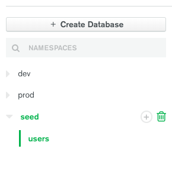
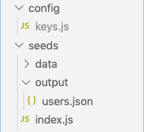

# Seeding with JavaScript into MongoDB Atlas with Connection URI
If you have any questions or are stuck at any point, please message me.

## Checking your Environment
See the section for `Check Your Environment` on this page and follow instructions for your respective machine: [https://docs.mongodb.com/guides/server/import/](https://docs.mongodb.com/guides/server/import/)

## Drop Database (optional)
If you want to reset your database before seeding, drop the database on MongoDB first.

Press the trash can icon in your MongoDB client:



## Set Up
Your folder structure should look like this:



### Define the data
Create a folder called `seeds` in the root of your app.
Create a folder called `data` in your `seeds` folder.

Make a file for each collection that you want to define seeds for. The name of your collection is whatever you named it in the schema of your collection.
e.g. `mongoose.model("User", UserSchema);` => name is `User` => create a file called `User.js`

From each file, export an array of objects which you want to fill that collection with

```javascript
module.exports = [
  {
    name: "Soon-Mi"
  },
  {
    name: "Dean"
  }
]
```

### [node seeds/index.js](https://github.com/ssoonmi/mongo-atlas-js-seed-demo/blob/master/seeds/index.js)
Create a file called `index.js` in the `seeds` folder, and copy the following into it:

```javascript
// seeds/index.js
const path = require('path');
const fs = require('fs');
const { exec } = require("child_process");
const db = require('../config/keys').mongoURI; // may need to change this line to the correct import
```

Change the line, `const db = require('../config/keys').mongoURI;` to wherever your MONGO_URI string actually lives.

Now we have to import the data that you created before into this file.

Below the above code that you copied, import the data that you created in your `data` folder like so:

`const users = require('./data/users');`

Make sure to name the variable the same way that you named the file. (e.g. if the file is called `User.js`, name the variable `const User`).

Next, you're going to define the `data` object which will be used to generate the seeds. The `data` object should just be a list of key value pairs of whatever you just imported.

`const data = { users };`

After that, paste the following into the `index.js` file:

```javascript
const output = "./output";

if (!fs.existsSync(output)) {
  fs.mkdirSync(output);
}

Object.entries(data).forEach(([key, value]) => {
  fs.writeFile(`output/${key}.json`, JSON.stringify(value), err => {
    if (err) throw err;
    console.log(`The file, ${key}.json has been saved!`);
  });

  const command = `mongoimport --uri "${db}" \
       --collection ${key} --jsonArray \
       --file ${path.join(__dirname, output, `${key}.json`)}`;

  exec(command, (error, stdout, stderr) => {
    if (error) {
      console.log(`error: ${error.message}`);
      return;
    }
    if (stderr) {
      console.log(`stderr: ${stderr}`);
      return;
    }
    console.log(`stdout: ${stdout}`);
  });
});
```

This allows us to create a collection from each of the seed files in our `data` folder.

We are all set up to run the seeds. Run the following command in your terminal: `node seeds/index.js`

If you want to make this a reoccurring command, include it in your `package.json` as a script like so:

```json
{
  "scripts": {
    "seed": "node seeds/index.js"
  }
}
```
